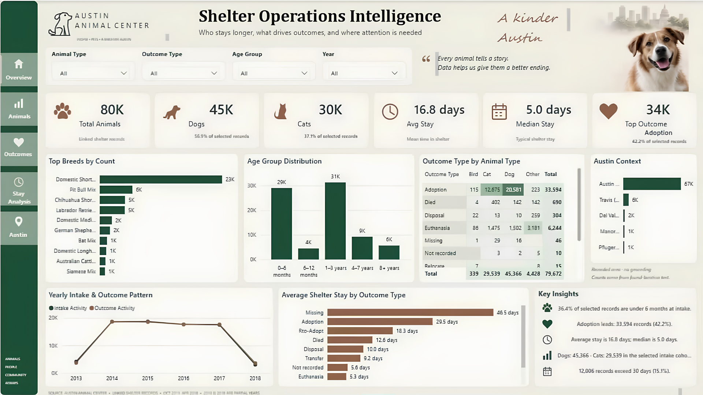

# Animal Shelter Power BI

An interactive Power BI project built with Austin Animal Center data to explore animal intakes, outcomes, shelter stay duration, breed patterns, age groups, and yearly trends.



## Project Overview

The goal of this project was to turn shelter records into a clear and visually engaging report rather than a standard corporate-style dashboard.

The report includes dedicated pages for:

- Overview
- Animals
- Outcomes
- Stay Analysis
- Austin

Interactive filters make it possible to explore the data by animal type, outcome, age group, and year.

## Key Insights

- **Adoption was the most common outcome**, with 33,594 records.
- **Stray animals were the largest intake group**, with 55,935 records.
- The **average shelter stay was 16.8 days**, while the median was about **5 days**, showing the effect of longer-stay cases on the overall average.
- Dogs and cats made up most of the shelter records, with **45,366 dog records** and **29,539 cat records**.

## Dashboard Features

- KPI cards for the main shelter metrics
- Breed and age-group analysis
- Outcome analysis by animal type
- Shelter stay analysis
- Yearly intake and outcome trends
- Interactive slicers and cross-filtering
- Custom visual styling inspired by a warm, human-centered shelter theme

## Tools Used

- **Power BI**
- **Power Query**
- **DAX**

## Dataset

The analysis is based on Austin Animal Center intake and outcome data covering **2013–2018**.

Main analytical file:

`aac_intakes_outcomes.csv`

The joined dataset contains **79,672 linked shelter records**.

## Repository Structure

```text
Animal-Shelter-PowerBI/
│
├── Animal_Shelter_PowerBI.pbix
├── dashboard-preview.png
├── data/
│   └── aac_intakes_outcomes.csv
└── README.md
```

## Dashboard Preview

The dashboard was designed with a soft cream background, dark green navigation, warm accent colors, and a minimal layout to keep the report easy to read while still visually distinctive.

---

Created as part of my Data Analytics portfolio.
